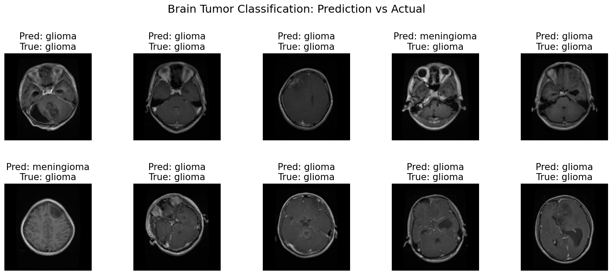

# Brain Tumor Classification using CNN

This project implements a **Convolutional Neural Network (CNN)** for classifying brain tumor images into different categories using MRI scans. The dataset includes images of **glioma**, **meningioma**, **notumor**, and an additional class.

---

## 📂 Dataset

The dataset is divided into two parts:

- **Training Data**: Used for model training.
- **Testing Data**: Used for evaluating model performance.

Each image is preprocessed as follows:
- Converted to **RGB** (if not already).
- Resized to **128x128** pixels.
- Normalized to pixel values in the range **[0,1]**.

---

## 🏗️ Model Architecture

The CNN model is built using **Keras (TensorFlow backend)** with the following layers:

1. **Conv2D (32 filters, 2x2, ReLU, same padding)**
2. **MaxPooling2D (2x2)**
3. **Dropout (0.25)**
4. **Conv2D (64 filters, 2x2, ReLU, same padding)**
5. **MaxPooling2D (2x2)**
6. **Dropout (0.25)**
7. **Conv2D (128 filters, 2x2, ReLU, same padding)**
8. **MaxPooling2D (2x2)**
9. **Dropout (0.25)**
10. **Flatten**
11. **Dense (128 units, ReLU)**
12. **Dropout (0.5)**
13. **Dense (4 units, Softmax)**

**Total Parameters:** ~4.23M

---

## ⚙️ Training

- **Loss Function:** Sparse Categorical Crossentropy  
- **Optimizer:** Adamax  
- **Metrics:** Accuracy  
- **Epochs:** 20  

### Training Results:
- **Training Accuracy:** ~95.7%  
- **Validation Accuracy:** ~91.6%  
- **Test Accuracy:** ~92.4%  

---

## 📊 Evaluation

- Test Accuracy: **92.45%**
- Test Loss: **0.2297**

The model was evaluated on the test dataset and demonstrated strong performance.

---

## 📈 Predictions

The trained model was used to make predictions on the test set. The following visualization shows predicted vs. actual tumor classes:



---

## 💾 Saving & Loading the Model

The trained model is saved in Keras format:

```python
model.save('brainTumorCNN_model.keras')
```
## 📚 Libraries Used  

- **numpy** – numerical computations  
- **pandas** – dataset handling  
- **matplotlib** – visualization  
- **seaborn** – advanced plots  
- **scikit-learn** – preprocessing & evaluation  
- **tensorflow / keras** – deep learning framework  
- **opencv-python** – image preprocessing (if required)  
- **Pillow** – image handling  

---
## 🚀 Deployment  

The project is deployed on **Hugging Face Spaces** using **Streamlit**.  

You can try the live demo here:  

👉 [Brain Tumor Classifier CNN - Hugging Face Spaces](https://huggingface.co/spaces/mayankrana16/BrainTumorClassifierCNN) 

---
## 👨‍💻 Developed By  

**Mayank Rana**  
*B.Tech CSE Student*  
